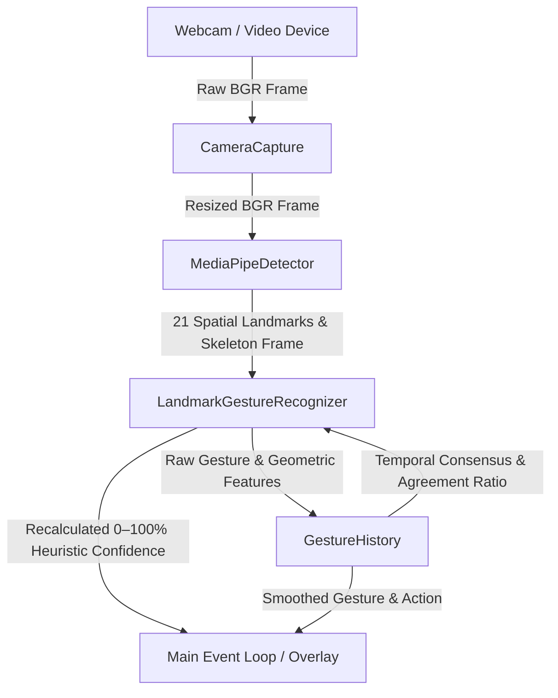

# ARCHITECTURE.md — System Architecture & Design (Strategy 1)

This document details the software architecture, data flow, component design, spatial geometry mathematics, and confidence evaluation logic of the **Real-Time Hand Gesture Recognition (HGR Strategy 1)** system.

---

## 🏗️ System Architecture

The application implements a decoupled, end-to-end processing pipeline where each stage receives immutable or type-safe input objects and produces explicit result structures (`results.py`).

---

## 🖐️ MediaPipe 21 Hand Landmark Topology

The detector extracts 21 spatial landmarks $(x, y, z)$ normalized to $[0, 1]$ relative to image dimensions ($z$ represents depth relative to the wrist):

| Landmark ID | Anatomical Joint | Finger / Structure |
|:-----------:|:----------------:|:------------------:|
| **0** | `WRIST` | Base of Palm / Reference Origin |
| **1** | `THUMB_CMC` | Thumb |
| **2** | `THUMB_MCP` | Thumb |
| **3** | `THUMB_IP` | Thumb |
| **4** | `THUMB_TIP` | Thumb Extreme |
| **5** | `INDEX_FINGER_MCP` | Index Knuckle |
| **6** | `INDEX_FINGER_PIP` | Index First Joint |
| **7** | `INDEX_FINGER_DIP` | Index Second Joint |
| **8** | `INDEX_FINGER_TIP` | Index Fingertip |
| **9** | `MIDDLE_FINGER_MCP` | Middle Knuckle |
| **10** | `MIDDLE_FINGER_PIP` | Middle First Joint |
| **11** | `MIDDLE_FINGER_DIP` | Middle Second Joint |
| **12** | `MIDDLE_FINGER_TIP` | Middle Fingertip |
| **13** | `RING_FINGER_MCP` | Ring Knuckle |
| **14** | `RING_FINGER_PIP` | Ring First Joint |
| **15** | `RING_FINGER_DIP` | Ring Second Joint |
| **16** | `RING_FINGER_TIP` | Ring Fingertip |
| **17** | `PINKY_MCP` | Pinky Knuckle / Palm Base Lateral |
| **18** | `PINKY_PIP` | Pinky First Joint |
| **19** | `PINKY_DIP` | Pinky Second Joint |
| **20** | `PINKY_TIP` | Pinky Fingertip |

---

## 📐 Geometric Formulation & Spatial Invariance

### 1. 3D Euclidean Distance
Between any two landmarks $P_1 = (x_1, y_1, z_1)$ and $P_2 = (x_2, y_2, z_2)$:

$$\text{dist}(P_1, P_2) = \sqrt{(x_1 - x_2)^2 + (y_1 - y_2)^2 + (z_1 - z_2)^2}$$

### 2. Anatomically Adaptive Finger Extension Ratio
To avoid orientation vulnerability (such as $y_{\text{tip}} < y_{\text{pip}}$ failing when the hand is tilted or inverted), finger extension is evaluated via radial expansion relative to the wrist:

$$R_{\text{ext}} = \frac{\text{dist}(\text{Wrist}, \text{Tip})}{\text{dist}(\text{Wrist}, \text{PIP})}$$

- When extended: $R_{\text{ext}} > 1.35$ (default threshold).
- When curled into fist: the tip curls towards the palm, dropping $R_{\text{ext}} < 1.0$.

### 3. Joint Alignment & Straightness Vector Math
A finger might have large tip distance while still being hooked or bent. Straightness is guaranteed by the cosine of the angle between consecutive segment vectors:

$$\vec{v}_1 = P_{\text{PIP}} - P_{\text{MCP}}, \quad \vec{v}_2 = P_{\text{Tip}} - P_{\text{PIP}}$$

$$\cos\theta = \frac{\vec{v}_1 \cdot \vec{v}_2}{\|\vec{v}_1\| \|\vec{v}_2\|} = \frac{(x_{\text{pip}} - x_{\text{mcp}})(x_{\text{tip}} - x_{\text{pip}}) + (y_{\text{pip}} - y_{\text{mcp}})(y_{\text{tip}} - y_{\text{pip}}) + (z_{\text{pip}} - z_{\text{mcp}})(z_{\text{tip}} - z_{\text{pip}})}{\|\vec{v}_1\| \|\vec{v}_2\|}$$

- Straight alignment: $\cos\theta > 0.85$.
- A finger is **extended** if and only if BOTH conditions hold: $R_{\text{ext}} > 1.35 \land \cos\theta > 0.85$.

### 4. Normalized Thumb Spread Ratio
The thumb does not articulate along the same axis as fingers. Its extension is measured by its lateral spread away from the palm base:

$$\text{thumb\_ratio} = \frac{\text{dist}(\text{Thumb\_Tip}, \text{Pinky\_MCP})}{\text{dist}(\text{Wrist}, \text{Pinky\_MCP})}$$

- Extended: $\text{thumb\_ratio} > 0.85$.
- Tucked: $\text{thumb\_ratio} \le 0.85$.

### 5. Proof of Rigid-Body Invariance
Under any rigid body 3D transformation $P' = s R P + \vec{t}$ (where $s > 0$ is uniform scale, $R \in SO(3)$ is an orthogonal rotation matrix $R^T R = I$, and $\vec{t} \in \mathbb{R}^3$ is translation):
1. **Distance**: $\text{dist}(P'_A, P'_B) = \|s R (P_A - P_B)\| = s \|P_A - P_B\| = s \, \text{dist}(P_A, P_B)$.
2. **Ratios**: $\frac{\text{dist}(P'_A, P'_C)}{\text{dist}(P'_A, P'_B)} = \frac{s \, \text{dist}(P_A, P_C)}{s \, \text{dist}(P_A, P_B)} = \frac{\text{dist}(P_A, P_C)}{\text{dist}(P_A, P_B)}$. The scale and rotation cancel out.
3. **Dot Products**: $\vec{v}'_1 \cdot \vec{v}'_2 = (s R \vec{v}_1) \cdot (s R \vec{v}_2) = s^2 \vec{v}_1^T R^T R \vec{v}_2 = s^2 (\vec{v}_1 \cdot \vec{v}_2)$.
   $$\cos\theta' = \frac{s^2 (\vec{v}_1 \cdot \vec{v}_2)}{(s \|\vec{v}_1\|)(s \|\vec{v}_2\|)} = \cos\theta$$

Hence, gesture classification is **strictly invariant** to position in frame, distance from camera, and 3D orientation.

---

## 📈 Heuristic Detection Confidence Score (0–100%)

The total confidence is an explainable heuristic score clamped strictly to $[0, 100]$:

$$\text{Confidence} = \text{clamp}\Big(S_{\text{quality}} + S_{\text{rule\_match}} + S_{\text{stability}}, \, 0, \, 100\Big)$$

### 1. Landmark Quality ($S_{\text{quality}} \in [0, 30]$)
- **Coordinate Variance** (0–15 pts): Verifies keypoints are spatially distributed rather than collapsed at a single point ($\sigma_{xy}^2 \ge 0.001$).
- **Palm Size & Proportions** (0–15 pts): Verifies $\text{dist}(\text{Wrist}, \text{Middle\_MCP}) \ge 0.04$ in normalized coordinates.

### 2. Rule Match Margin ($S_{\text{rule\_match}} \in [0, 50]$)
- **Base Score**: 30.0 pts for a valid target gesture match (10.0 pts for "Unknown").
- **Margin Bonus** (0–20 pts): Scales linearly with the margin by which extension ratios exceed $1.35$ (for extended fingers) or stay below $1.35$ (for closed fingers), plus straightness cosine margins above $0.85$.

### 3. Temporal Stability ($S_{\text{stability}} \in [0, 20]$)
- Computed from the fraction of identical frames in the sliding history buffer:
  $$S_{\text{stability}} = \min\left(20.0, \, \frac{\text{count}(\text{gesture})}{\text{buffer\_size}} \times 20.0\right)$$

---

## 🧩 Component Breakdown

### 1. `MediaPipeDetector` (`src/mediapipe_detector.py`)
- Initializes MediaPipe Hands pipeline with configurable confidence thresholds.
- Validates input frames defensively (raising `TypeError`/`ValueError` on invalid frames).
- Draws skeleton connections on an annotated copy of the frame.
- Returns plain Python list of coordinate dictionaries: `[{'id': int, 'x': float, 'y': float, 'z': float}, ...]`.
- Contains **no gesture classification logic**.

### 2. `LandmarkGestureRecognizer` (`src/gesture_recognition.py`)
- Operates purely on landmark coordinate dictionaries.
- Contains **no dependency on MediaPipe APIs or classes**.
- Extracts relative geometric features, evaluates finger extension states, and classifies gestures.
- Evaluates the 0–100% heuristic confidence score with component breakdowns.

### 3. `GestureHistory` (`src/gesture_history.py`)
- Sliding window temporal buffer (default size 8 frames).
- Consensus voting engine (requires 4 matching frames) to debounce rapid switches.
- Ambiguous (`Unknown`) and empty (`None`) frames do NOT vote as valid candidates.

### 4. `main.py` & `main_debug.py`
- Direct startup without blocking on HSV calibration files.
- Real-time video loop displaying live skeleton, stable gesture, action, confidence %, and FPS.
