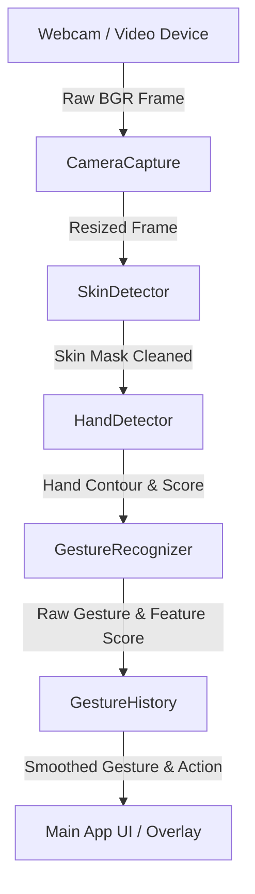
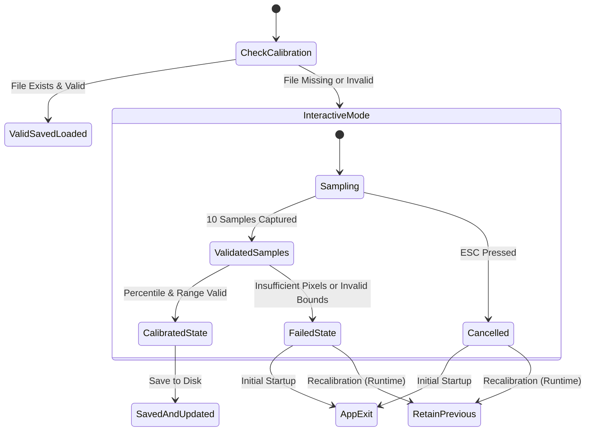

# ARCHITECTURE.md — System Architecture & Design

This document details the software architecture, data flow, component design, state machines, and confidence evaluation logic of the **Real-Time Hand Gesture Recognition (HGR)** system.

---

## 🏗️ System Architecture

The application is structured as an end-to-end processing pipeline where each stage receives immutable or type-safe input objects and produces explicit result structures (`results.py`).

---

## 🧩 Component Breakdown

### 1. `CameraCapture` (`src/camera.py`)
- Wraps OpenCV `VideoCapture`.
- Enforces strict validation on `resize_factor` ($0.1 \le factor \le 1.0$).
- Ensures process-safe resource cleanup (`release()`) on initialization failure, unhandled exceptions, and object destruction.
- Computes measured FPS dynamically.

### 2. `CalibrationManager` (`src/calibration.py`)
- Handles save/load of HSV color thresholds.
- Resolves configuration filepath (`config/hsv_calibration.json`) relative to project root (`PROJECT_ROOT`), preventing current-working-directory bugs.
- Validates bounds before writing to disk to prevent saving invalid thresholds.

### 3. `SkinDetector` (`src/skin_detection.py`)
- Converts BGR frames to HSV color space.
- Validates HSV threshold ranges for OpenCV conventions ($H \in [0, 180], S \in [0, 255], V \in [0, 255]$).
- Supports normal ($H_{\text{lower}} \le H_{\text{upper}}$) and circular hue wrap-around ($H_{\text{lower}} > H_{\text{upper}}$, requiring $H_{\text{lower}} \ge 120$ and $H_{\text{upper}} \le 60$).
- Performs morphological cleaning (`MORPH_OPEN` and `MORPH_CLOSE`).

### 4. `HandDetector` (`src/hand_detection.py`)
- Extracts external contours from skin masks.
- Filters out invalid candidate contours (insufficient area, frame border touch, background strips, extreme aspect ratios).
- Computes a candidate quality score based on circularity, solidity, extent, and convexity defects.
- Rejects best contour if its score is below `min_contour_score` ($0.5$), returning `No Hand Detected`.

### 5. `GestureRecognizer` (`src/gesture_recognition.py`)
- Extracts geometric features: Area, Solidity, Extent, Aspect Ratio, Elongation, Convexity Defects.
- Classifies gestures according to threshold rules (most-constrained to least-constrained):
  - **Fist**: Defects $= 0$, Solidity $\ge 0.88$, Extent $\ge 0.60$, Elongation $\le 1.45$
  - **One Finger**: Defects $\le 1$, Elongation $\ge 2.0$
  - **Two Fingers**: $1 \le \text{Defects} \le 2$, Elongation $\ge 1.25$
  - **Open Palm**: Defects $\ge 3$, Solidity $\le 0.88$, Elongation $\le 1.74$ (checked last)
- Evaluates **0–100% Heuristic Detection Confidence**.

### 6. `GestureHistory` (`src/gesture_history.py`)
- Sliding window temporal buffer (default size 8 frames).
- Consensus voting (requires 4 matching consecutive predictions) to eliminate frame-to-frame flicker.

---

## 🔄 Calibration State Machine

---

## 📈 Heuristic Detection Confidence Score (0–100%)

The confidence score is an explainable, heuristic metric calculated as follows:

$$\text{Confidence} = \text{Clamp}_{0}^{100}\left( S_{\text{contour}} + S_{\text{geometry}} + S_{\text{gesture}} + S_{\text{history}} \right)$$

1. **Contour Score Contribution** ($S_{\text{contour}} \in [5, 35]$):
   Scale contour detection score: $\min(35.0, \max(5.0, \text{score} \times 5.0))$.
2. **Geometric Plausibility Contribution** ($S_{\text{geometry}} \in [0, 30]$):
   +10 pts for valid Solidity ($0.4 \le \text{solidity} \le 0.95$), +10 pts for Extent ($0.25 \le \text{extent} \le 0.85$), +10 pts for Aspect Ratio ($0.3 \le \text{aspect\_ratio} \le 3.5$).
3. **Gesture Feature Match Contribution** ($S_{\text{gesture}} \in [0, 25]$):
   +25 pts for matching a recognized gesture ("Fist", "Open Palm", "One Finger", "Two Fingers"), +8 pts for "Unknown".
4. **Temporal History Contribution** ($S_{\text{history}} \in [0, 10]$):
   History ratio matching last consensus gesture $\times 10.0$.
